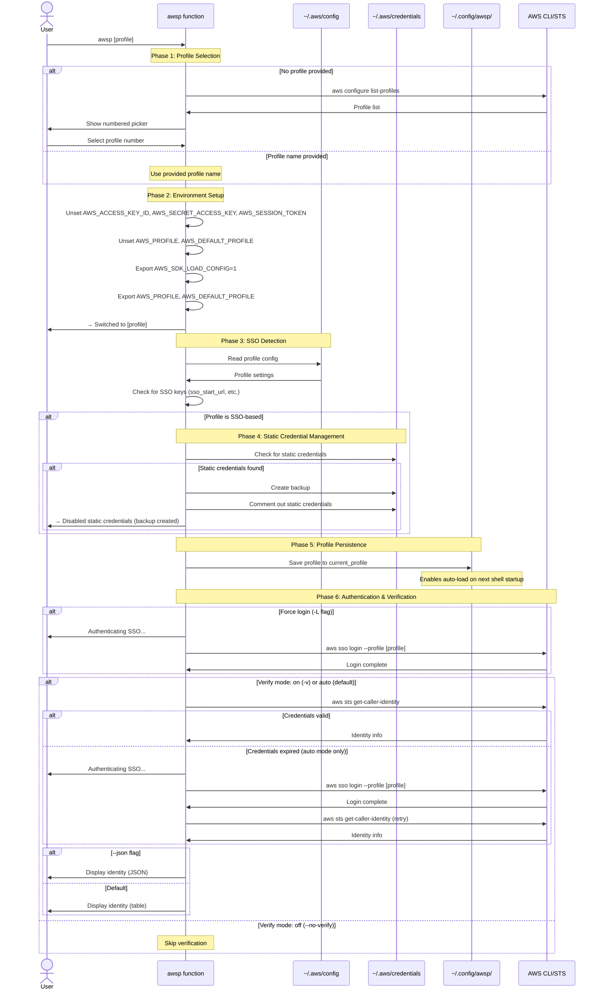

<p align="center">
  
</p>

# awsp — AWS profile switcher

[](https://username.github.io/github-repo-template/)

Tiny cross-shell function to switch AWS profiles (with SSO auto-login if needed).

- Works in **Bash** and **Zsh**.
- No `fzf` dependency — numbered picker when no profile is passed.
- Extras: list profiles, show current, unset env, force login, verify identity (table/json).

## Install (recommended)

```bash
git clone https://github.com/duyluann/awsp.git
cd awsp

make install

# then restart your shell, or run:
. "$HOME/.config/awsp/awsp.sh"
```

This installs into `~/.config/awsp/` and adds a source line to your shell rc file.

After installation, **reload your shell** or source the script manually as shown above.

## Uninstall

```bash
make uninstall
```

Removes all installed files and cleans up shell rc file entries.

## Usage

### Quick Start

Switch to a profile by name:

```bash
awsp my-profile-name
```

Or run without arguments to get an interactive numbered picker:

```bash
awsp
# Pick an AWS profile:
#  1) dev-account
#  2) staging-account
#  3) prod-account
# Select number: 2
```

### Command Reference

```text
awsp [options] [PROFILE]

Options:
  -h, --help         Show help and exit
  -V, --version      Show version and exit
  -l, --list         List profiles and exit
  -c, --current      Print current AWS profile and exit
  -u, --unset        Unset AWS profile & static creds and exit
  -U, --upgrade      Upgrade awsp to latest version
  -L, --login        Force "aws sso login" for the selected/current profile
  -v, --verify       Verify identity via STS (default: auto)
      --no-verify    Do not verify identity
      --json         Output STS identity as JSON instead of table
  -q, --quiet        Suppress non-essential output
```

### Examples

List all available profiles:

```bash
awsp -l
```

Switch to a specific profile:

```bash
awsp dev-admin
```

Force SSO login for a profile:

```bash
awsp -L prod
```

Verify identity and show in JSON format:

```bash
awsp -v qa --json
```

Show current profile:

```bash
awsp -c
```

Unset all AWS environment variables:

```bash
awsp -u
```

Quiet mode (minimal output):

```bash
awsp -q prod
```

Show version:

```bash
awsp --version
```

Upgrade to latest version:

```bash
awsp --upgrade
```

### Shell Completion

**Zsh**: Tab completion is automatically enabled after installation. Press `<TAB>` after typing `awsp` to complete profile names and options.

```bash
awsp <TAB>           # completes with available profile names
awsp -<TAB>          # completes with available options
```

**Bash**: Tab completion is automatically enabled after installation and works similarly.

### Troubleshooting

**Completion not working?**

For Zsh, verify the completion function is loaded:

```bash
type _awsp
# Should output: _awsp is a shell function from /home/user/.config/awsp/completions/_awsp
```

If completion still doesn't work:

1. Make sure you've reloaded your shell after installation
2. Try sourcing the script manually: `. "$HOME/.config/awsp/awsp.sh"`
3. Check that the completions directory is in your fpath: `echo $fpath | grep awsp`

**No profiles found?**

Make sure you have at least one AWS profile configured:

```bash
aws configure sso
# or manually edit ~/.aws/config and ~/.aws/credentials
```

## Requirements

- AWS CLI v2 (recommended, but will work without it for basic profile switching)
- At least one SSO profile configured: `aws configure sso`

## How It Works

1. **Profile Discovery**: Reads profiles from `aws configure list-profiles` or parses `~/.aws/config` and `~/.aws/credentials`
2. **Environment Setup**: Exports `AWS_PROFILE` and `AWS_DEFAULT_PROFILE`, clears static credentials
3. **SSO Auto-Login**: Automatically runs `aws sso login` if credentials are expired (when AWS CLI is available)
4. **Identity Verification**: Optionally verifies your identity via `aws sts get-caller-identity`

## Sequence Diagram(s)

### Complete Profile Switching Flow



### Quick Actions Flow

For reference, quick actions (--list, --current, --unset) bypass the full flow:

- `awsp --list`: Lists all profiles from AWS CLI or config files
- `awsp --current`: Prints current AWS_PROFILE value
- `awsp --unset`: Unsets all AWS environment variables and removes saved profile

## License

This repository is licensed under the MIT License. See the [LICENSE](LICENSE) file for more information.
