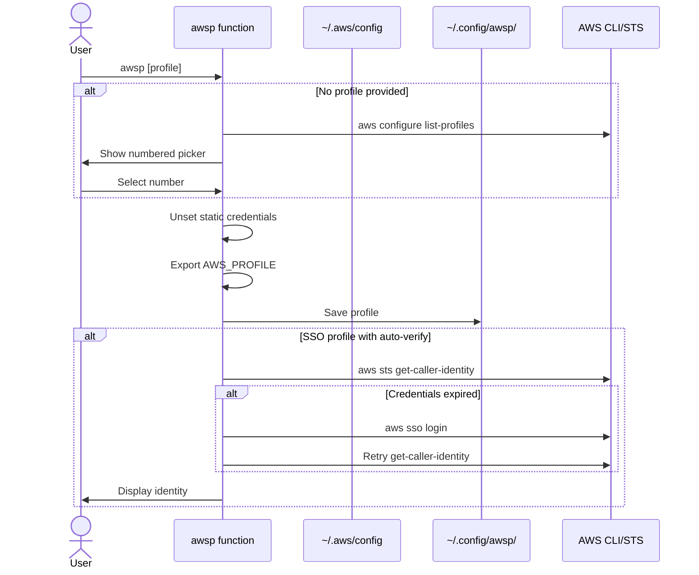

# Usage Guide

Complete reference for all awsp commands and features.

## Command Reference

```text
awsp [options] [PROFILE]

Options:
  -h, --help         Show help and exit
  -V, --version      Show version and exit
  -l, --list         List profiles and exit
  -c, --current      Print current AWS profile and exit
  -u, --unset        Unset AWS profile & static creds and exit
  -U, --upgrade      Upgrade awsp to latest version
  -L, --login        Force "aws sso login" for the selected/current profile
  -v, --verify       Verify identity via STS (default: auto)
      --no-verify    Do not verify identity
      --json         Output STS identity as JSON instead of table
  -q, --quiet        Suppress non-essential output
```

## Profile Switching

### By Name

Pass a profile name directly:

```bash
awsp dev-admin
```

### Interactive Picker

Run without arguments to get a numbered list:

```bash
awsp
# Pick an AWS profile:
#  1) dev-account
#  2) staging-account
#  3) prod-account
# Select number:
```

### List All Profiles

```bash
awsp --list
```

### Show Current Profile

```bash
awsp --current
```

### Unset Profile

Clear all AWS environment variables and the saved profile:

```bash
awsp --unset
```

## SSO Auto-Login

When you switch to an SSO profile, awsp automatically detects expired credentials and triggers `aws sso login`.

### Default Behavior (Auto Mode)

```bash
awsp my-sso-profile
# If credentials are expired, awsp will:
#   1. Detect the expiration via `aws sts get-caller-identity`
#   2. Run `aws sso login --profile my-sso-profile`
#   3. Verify the new credentials
```

### Force Login

Use `-L` to force an SSO login regardless of credential status:

```bash
awsp -L my-sso-profile
```

### Skip Verification

Use `--no-verify` to skip identity verification entirely:

```bash
awsp --no-verify my-sso-profile
```

## Identity Verification

### Table Output (Default)

```bash
awsp -v my-profile
```

Displays identity information in a formatted table.

### JSON Output

```bash
awsp -v my-profile --json
```

Displays the raw JSON output from `aws sts get-caller-identity`.

## Environment Variables

When you switch profiles, awsp manages these environment variables:

| Variable | Action |
|---|---|
| `AWS_PROFILE` | Set to selected profile |
| `AWS_DEFAULT_PROFILE` | Set to selected profile |
| `AWS_SDK_LOAD_CONFIG` | Set to `1` |
| `AWS_ACCESS_KEY_ID` | Unset (cleared) |
| `AWS_SECRET_ACCESS_KEY` | Unset (cleared) |
| `AWS_SESSION_TOKEN` | Unset (cleared) |

Static credentials are cleared to prevent conflicts with SSO-based authentication.

## Profile Persistence

awsp saves your current profile to `~/.config/awsp/current_profile`. On shell startup, awsp automatically loads this saved profile, so your AWS context persists across terminal sessions.

## Shell Completion

### Zsh

Tab completion is automatically enabled after installation:

```bash
awsp <TAB>           # completes profile names
awsp -<TAB>          # completes options
```

If completion isn't working:

1. Verify the completion function is loaded:
   ```bash
   type _awsp
   ```
2. Ensure your shell was reloaded after installation
3. Check the completions directory is in fpath:
   ```bash
   echo $fpath | grep awsp
   ```

### Bash

Tab completion is also automatically enabled after installation and works similarly:

```bash
awsp <TAB>           # completes profile names
```

## Quiet Mode

Suppress non-essential output:

```bash
awsp -q prod
```

## Self-Upgrade

Upgrade awsp to the latest version:

```bash
awsp --upgrade
```

This supports both git-based installations (pulls latest) and release-based installations (downloads latest release).

## How It Works


